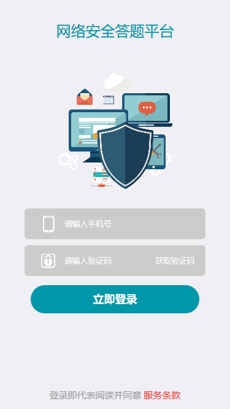
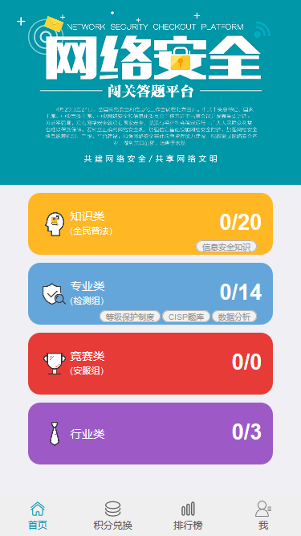
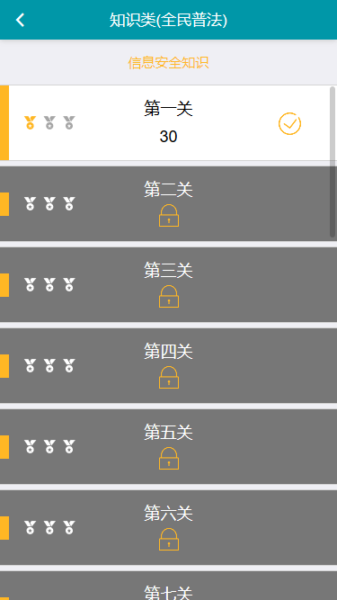
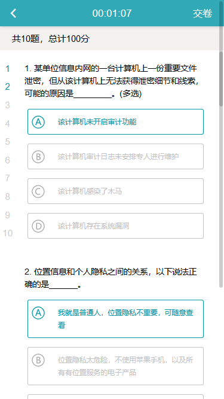
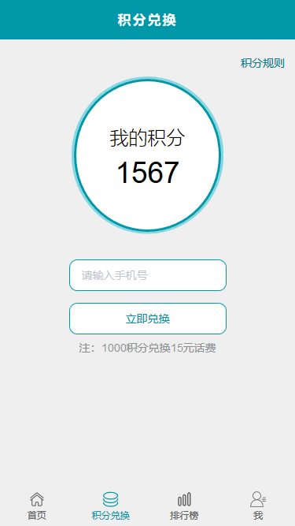
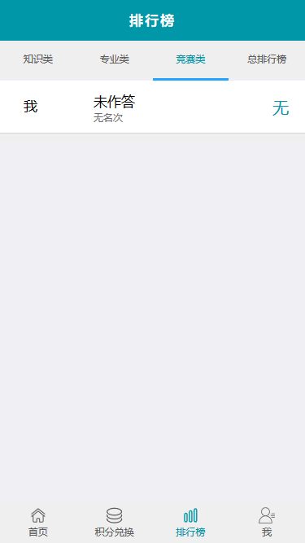
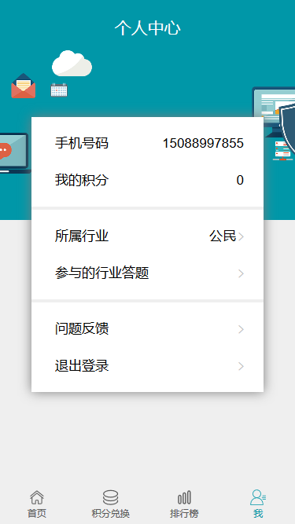
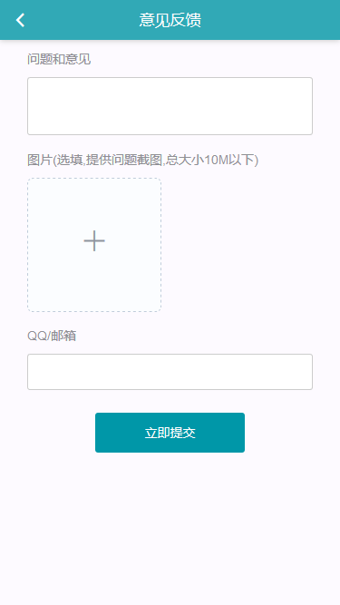

## 演示地址

前端界面，请在手机端打开后刷新：[传送门](http://qa.miaoroom.com:82/dist)

后台管理界面：[传送门](http://qa.miaoroom.com:82/admin/login)
管理员账号：admin
密码：123123

## 界面截图



---



---



---



---



---



---



---



---


## 简单概述
这是带登录和设置功能的mui模板项目，主要为了演示登录流程及设置界面div窗口切换效果；

## 核心功能
1. 启动App后校验登录状态，若已登录，直接跳转应用首页；否则，显示登录页面；
2. 支持本地注册；
3. 支持设置手势密码，登录时可使用手势密码代替账号、密码；
4. 支持评分、分享、拨打客服电话

## UI组件库文档页面

**https://mint-ui.github.io/docs/#/zh-cn2/tabbar**

**http://element-cn.eleme.io/#/zh-CN**


## 调试方法

本项目采用webpack打包，开发阶段使用webpack-dev-server进行开发

```sheel

npm run dev2

```

生产阶段使用build打包静态资源，打包的路径为/dist/

```sheel

npm run build

```

## axios 使用说明

本项目ajax使用axios进行发送请求，并对axios进行了简单的封装，以下是对封装的具体流程和说明。

``` html

http://panmiaorong.top/2018/08/09/vue-axios/

```

## GIT双人开发流程

打开电脑准备开发前，先使用`git pull origin dev`拉取最新版本。

每开发一小段，请经常使用`git add .` -> `git commit -m "开发的内容"` -> `git push origin dev`（推送）

## mockjs（8.28新增）

具体说明文档请移步

```html

http://panmiaorong.top/2018/08/09/mockjs/

```

本项目现可采用mockjs在前端自行模拟数据。

我们在Vue或React的文档里时不时就会看到这个名词，那么mock到底是什么东西呢？

mock有“愚弄、欺骗”之意，在前端领域，mock可以理解为我们前端开发人员制造的假数据。也就是说不是由后台真实制造，而是由我们其他一些方式模拟的数据，例如借助mock.js。

通过这种方式，我们能在一定程度上实现前后端分离的开发流程。因为如果前端开发人员能够自己模拟数据的话，就不必等着拿到后端的接口才能完成剩下的工作，使得前端人员独立开发的能力增强，在此基础上做到前端后台各自独立的开发（当然这个前提是有 “写好的+详细的+不再临时改变的” 公共数据接口的文档）

最后对接的工作是前后端联调数据，因为前端mock的辅助，我们尽可能地减少了前后端对接过程中的效率损耗

它可以生成大量不同类型的模板数据，从最基本的随机数组/数字/对象/字符串，再到一个域名，一个地址（省/市），一个标题，一段文字，甚至给定宽高和颜色的图片，它都能模拟生成！ 这就是mock.js的强大之处

相比起生成随机的模拟数据，其实我们更关心的是当我们发送Ajax请求的时候，我们能够接收到这些数据，这就是mock.js的第二大作用：拦截Ajax请求，当你对一个mock.js所指定的URL发起Ajax请求的时候，mock.js会将1中的模板数据作为响应数据回传给你，从而让你开发能在相当于已经拿到后端接口的前提下进行前端开发！